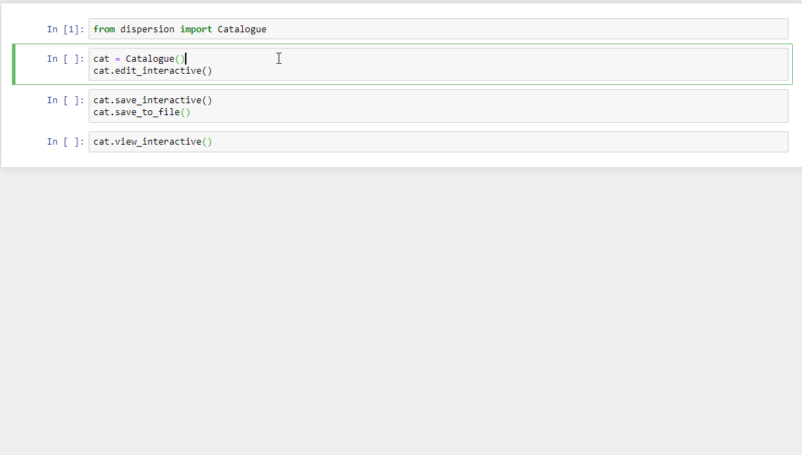

The Catalogue Class
===================

This page describes the basic usage of the ``Catalogue`` class. This class
is used for interfacing with the catalogue file. The catalogue provides meta
data on all of the materials is in the database. These materials can then be
loaded as ``Material`` objects into Python using the catalogue.

::

  from dispersion import Catalogue
  cat = Catalogue()

The catalogue relies on a specific file system structure in order to find the
files in the database. An example of the file structure is the following,

::

  database_root/
      catalogue.csv
      UserData/
          userfile1.txt
          userfile2.yml
          ...
      Module1/
          Module1_subdir1/
              mat1.yml
              mat2.yml
          Module1_subdir2/
              anothermat.yml
          ...
      Module2/
      ...

The catalogue files sits at the root level of the database filesystem. The other
folders present in the root directory are the installed modules. By default a
module called UserData is installed for the user to keep their data. Other
modules consist of literature material databases available for download.
See modules for a list of supported modules.

Building the Catalogue
----------------------

Whenever new files are added to the database file system, the catalogue needs to
be rebuilt.

To build the catalogue you can use the script included in this package

::

  > dispersion_catalogue_rebuild

or alternatively you can rebuild from inside python

::

  from dispersion import Catalogue
  cat = Catalogue(rebuild='All')

When rebuilding the catalogue, you can choose to rebuild either some or all of
the modules.

Setting an Alias
----------------

Many materials have different data files associated with them. In order to
uniquely identify materials in the catalogue, a unique alias can be assigned to
each material. This alias will be used later to extract the material from the
database. By default all materials do not have any alias defined.

In order to set an alias, the catalogue file needs to be edited. This can be done
in three ways: Externally, using python or interactively using iPython with the
``qgrid`` extension.

The following shows how to edit an alias using python.

::

    row = cat.database[(cat.database.Name == name)]
    cat.register_alias(row, "alias")

This will not work if there are multiple materials in the catalogue with the same
"Name" attribute. In order to set the alias in this case, either use the path
to the file on the inside the module folder as the filter,

::

    row = cat.database[(cat.database.Path == path/to/file.txt)]
    cat.register_alias(row, "alias")
    cat.save_to_file()

or use the interactive editing. For this the qgrid IPython extension needs to be
installed. After installation, open the catalogue in an IPython like environment
(such as a Jupyter notebook) and use,

::

  cat.edit_interactive()

note that "Interactive" must be set to true in the package configuration file
to use interactive editing. After the aliases have been set in the alias column
for the appropriate materials, the catalogue must be saved via,

::

  cat.save_interactive()
  cat.save_to_file()

The following animation shows the process of interactively editing the
catalogue.

Accessing the Catalogue
-----------------------

To get a material from the database using the catalogue, use:

::

  mat = cat.get_material("<mat_alias>")

this returns a Material object. If the argument of get_material is a string,
then it must refer to the alias of the material in the catalogue. If the
argument is an integer, it refers to the row number in the catalogue.

Full API
--------

.. py:currentmodule:: catalogue

.. autoclass:: Catalogue
                :members:
